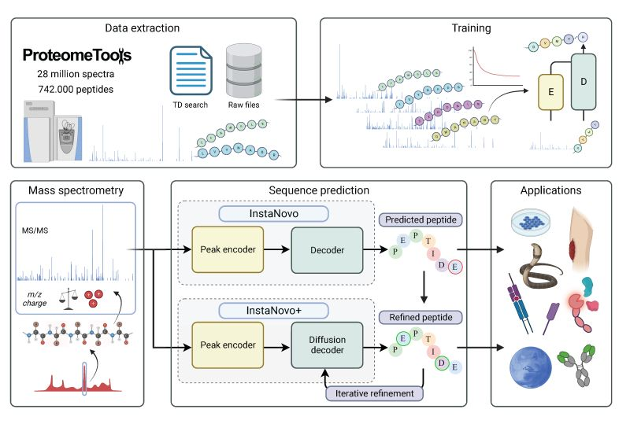

# De novo peptide sequencing with InstaNovo

The official code repository for InstaNovo. This repo contains the code for training and inference
of InstaNovo and InstaNovo+.

Links:

- bioRxiv: https://www.biorxiv.org/content/10.1101/2023.08.30.555055v1



Developed by: InstaDeep and the Department of Biotechnology and Biomedicine - Technical University of
Denmark

## Usage

### Installation

To use InstaNovo, we need to install the module via `pip`:

```bash
pip install instanovo
```

Note: InstaNovo is built for Python >= 3.8

### Training

To train auto-regressive InstaNovo:

```bash
usage: python -m instanovo.transformer.train train_path valid_path [-h] [--config CONFIG] [--n_gpu N_GPU] [--n_workers N_WORKERS]

required arguments:
  train_path        Training data path
  valid_path        Validation data path

optional arguments:
  --config CONFIG   file in configs folder
  --n_workers N_WORKERS
```

Note: data is expected to be saved as Polars `.ipc` format. See section on data conversion.

To update the InstaNovo model config, modify the config file under
[configs/instanovo/base.yaml](configs/instanovo/base.yaml)

### Prediction

To evaluate InstaNovo:

```bash
usage: python -m instanovo.transformer.predict data_path model_path [-h] [--denovo] [--config CONFIG] [--subset SUBSET] [--knapsack_path KNAPSACK_PATH] [--n_workers N_WORKERS]

required arguments:
  data_path         Evaluation data path
  model_path        Model checkpoint path

optional arguments:
  --denovo          evaluate in de novo mode, will not try to compute metrics
  --output_path OUTPUT_PATH
                    Save predictions to a csv file (required in de novo mode)
  --config CONFIG
                    file in configs folder
  --subset SUBSET
                    portion of set to evaluate
  --knapsack_path KNAPSACK_PATH
                    path to pre-computed knapsack
  --n_workers N_WORKERS
```

### Converting datasets to Polars

To convert a dataset to polars `.ipc`:

```bash
usage: python -m instanovo.utils.convert_ipc source target [-h] [--source_type SOURCE_TYPE] [--max_charge MAX_CHARGE]

required arguments:
  source            source data
  target            target ipc file

optional arguments:
  --source_type SOURCE_TYPE
                    type of input data. currently supports [mgf, csv]
  --max_charge MAX_CHARGE
                    maximum charge to filter
```

## Roadmap

This code repo is currently under construction.

**ToDo:**

- Add diffusion model code
- Add data preprocessing pipeline
- Add model checkpoints to releases and HuggingFace
- Add datasets to HuggingFace
- Multi-GPU support

## License

Code is licensed under the Apache License, Version 2.0 (see [LICENSE](LICENSE.txt))

The model checkpoints are licensed under Creative Commons Non-Commercial
([CC BY-NC-SA 4.0](https://creativecommons.org/licenses/by-nc-sa/4.0/))

## BibTeX entry and citation info

```bibtex
@article{eloff_kalogeropoulos_2023_instanovo,
	title = {De novo peptide sequencing with InstaNovo: Accurate, database-free peptide identification for large scale proteomics experiments},
	author = {Kevin Eloff and Konstantinos Kalogeropoulos and Oliver Morell and Amandla Mabona and Jakob Berg Jespersen and Wesley Williams and Sam van Beljouw and Marcin Skwark and Andreas Hougaard Laustsen and Stan J. J. Brouns and Anne Ljungars and Erwin Marten Schoof and Jeroen Van Goey and Ulrich auf dem Keller and Karim Beguir and Nicolas Lopez Carranza and Timothy Patrick Jenkins},
	year = {2023},
	doi = {10.1101/2023.08.30.555055},
	publisher = {Cold Spring Harbor Laboratory},
	URL = {https://www.biorxiv.org/content/early/2023/08/31/2023.08.30.555055},
	journal = {bioRxiv}
}
```
